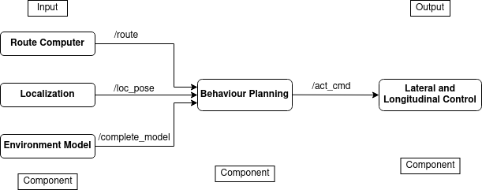

## Component Description
Behaviour Planning integrates inputs from the Environmental Model and Route Computer, determining the vehicle's path, speed, and maneuvers based on the surrounding conditions. It outputs speed limits and maneuver commands, which are executed by the Lateral and Longitudinal Control systems.
| In/Out | Topic Name| Message Type | Description | 
| --------- | ---------- | ---------- | ----------- |
| Input | /route|  nav_msgs/msg/Path| A optimum route from the vehicle's location to the parking spot | |
| Input |/complete_model | OccupancyGrid|Complete model of where the vehicle is located with respect to its environment | |
| Input |/loc_pose | PoseStamped|Location of Ego Vehicle | |
| Output |/cmd_vel | geometry_msgs/Twist | linear and angular velocities of the vehicle |

## The RQT Graph


## Behaviour Planning Block Diagram

 


 ## Installation Instructions

To install the Behaviour Planning package, do follow the steps below:

### Step 1: Create a worksapce

Open the terminal, navigate to the worksapce and create a 'src' directory where you want to clone the repository. 

```shell
mkdir src
```
### Step 2: Clone the Repository
Navigate to 'src' and follow the given command to clone the repository.
```shell
git clone https://git.hs-coburg.de/ADAPT/adapt_behplan.git
```
### Step 3: Build the Package
After cloning the repository, navigate back to the workspace
```shell
cd ..
```
Now, build the package using **`colcon`**:
```shell
colcon build --symlink-install
```
### Step 4: Source the setup file
Once the build is complete, you'll need to source the workspace to make it available to ROS2:
```shell
source install/setup.bash
```
### Step 5: Now Run the Node
You can now launch the Behaviour Planning node:
The entry point for Behaviour Planning is **`behaviour_node`**.
```shell
ros2 run adapt_behplan behaviour_node
