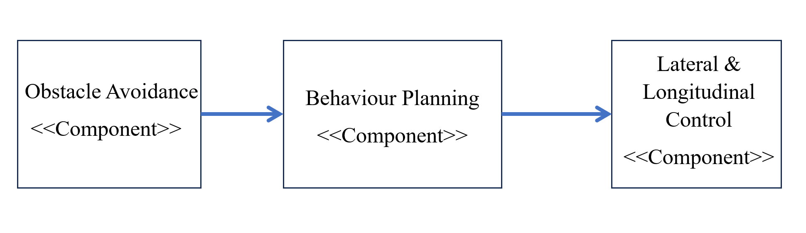

## Component Description
Behaviour Planning integrates inputs from the Environmental Model and Route Computer, determining the vehicle's path, speed, and maneuvers based on surrounding conditions. It outputs waypoints, speed limits, and maneuver commands, which are executed by the Lateral and Longitudinal Control systems.
| Component | Behaviour Planning |
|-----------|---------------------|
| **Input** | - Optimal Route   - Virtual spatial time environment. |
| **Output** | - Way points (Path Trajectory)   - Speed Limit   - Manoeuvre Commands |
| **Connected Components** | **Input** - Route Computer, Environment model   **Output** - Lateral and Longitudinal Control |
## Behaviour Planning Block Diagram
 