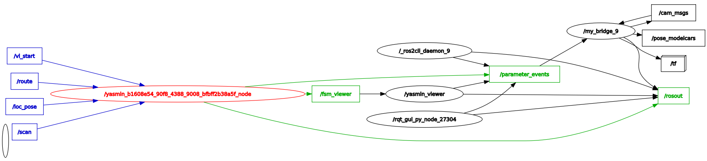
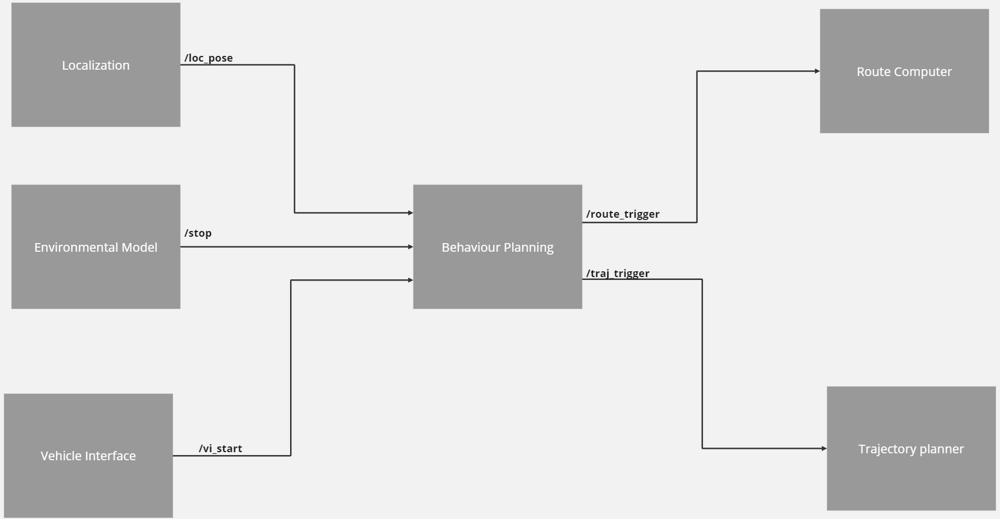

:bulb: Maintainer `AMOD PATIL'
## Component Description
Behaviour Planning is state machine which helps the Ego Vehicle to change states based on the situations and types of inputs it receives. The behaviour planning has 5 states Idle, Drive, Stop when a obstacle is detected, Stop near the parking, Park. The Ego vehicle is in idle state where it receives the 'vi_start' trigger from the adapt_vi from which it transition into drive state which has 3 outcomes first is Drive, second is Stop near parking spot, third is Stop when a obstacle is detected. The Drive outcome is achieved when the adapt_roucomp has published a 'route'. Once Ego-vehicle is driving if the adapt_envmod publishes the 'stop' the Ego-vehicle will transition into the Stop when a obstacle is detected. Once the Ego-vehicle has reached the location near the parking spot which is calculated using the current pose which is received from adapt_loc and the goal pose of the path which is received from adapt_roucomp. Once the Ego Vehicle is at the goal pose of the route Park state is triggered where adapt_trajp is set to choose the Park trajectory to park the vehicle. Once the vehicle is parked it returns to idle state.

State 1: Idle

| In/Out | Topic Name| Message Type | Description | 
| --------- | ---------- | ---------- | ----------- |
| Input | /vi_start|string| Start trigger to transition into Drive State | |
| Output |/route|PoseArray| A optimum route from the vehicle's location to the parking spot |

State 2: Drive

| In/Out | Topic Name| Message Type | Description | 
| --------- | ---------- | ---------- | ----------- |
| Input | /route|PoseArray| A optimum route from the vehicle's location to the parking spot | |
| Input |/stop| Bool|This message is published when the node detects obstacle in its close range(forward) | |
| Input |/loc_pose |PoseStamped|Location of Ego Vehicle | |

State 3: Stop when a obstacle is detected

| In/Out | Topic Name| Message Type | Description | 
| --------- | ---------- | ---------- | ----------- |
| Input | /stop|Bool| This message is published when the node detects obstacle in its close range(forward) | |
| Output ||Idle|

State 4: Stop near the parking spot

| In/Out | Topic Name| Message Type | Description | 
| --------- | ---------- | ---------- | ----------- |
| Input | /route|PoseArray| A optimum route from the vehicle's location to the parking spot | |
| Input |/loc_pose |PoseStamped|Location of Ego Vehicle | |
| Output ||Idle|

State 5: Park

| In/Out | Topic Name| Message Type | Description | 
| --------- | ---------- | ---------- | ----------- |
| Input | /traj_trigger|PoseArray| A optimum route from the vehicle's location to the parking spot | |
| Input |/loc_pose |PoseStamped|Location of Ego Vehicle | |
| Output ||Parked|


## The RQT Graph



## Behaviour Planning Block Diagram 



## Functionality
The behaviour Planning act as the brain of the Ego-vehicle where it receives several inputs from various components and based on the inputs received it triggers the specific functions. It has 5 States and particular state has their own outcomes.
1. Idle 
2. Drive
3. Stop when an obstacle is detected
4. Stop near the parking spot
5. Park

There a few components are continuously publishing through out the entire process of the vehicle.
adapt_envmod
adapt_loc
 
**State: Idle**


Components  

adapt_loc

adapt_envmod

adapt_vi

 The idle state has only one outcome which is drive state. In the idle state the vehicle is continuously scanning for the object in front via adapt_envmod and the adapt_loc is being used to know the location of the Ego-vehicle. The behaviour planning will listen to the topic 'vi_start' from adapt_vi and once 'vi_start is heard the Ego-vehicle will transition into Drive state. 

**State: Drive**


Components 
adapt_loc
adapt_envmod
adapt_roucomp
adapt_trajp

The Drive state has three outcomes Drive, Stop when an obstacle is detected, Stop near the parking spot. In the Drive state when topic 'vi_start' is heard it triggers the adapt_roucomp which publishes a topic '/route' which is a PoseArray to transition into the drive. Once the Ego-vehicle is in Drive it continuously scan for obstacle in its path, this is done via adapt_envmod and if a obstacle is detected the adapt_envmod sends a Bool message in the topic '/stop' which transition the Ego-vehicle into stop when an obstacle is detected state and the Ego-vehicle goes into the Idle state. If there is no obstacle in the path of the Ego-vehicle then stays in the Drive and it calculates the distance to goal pose using its current position received from the adapt_loc and once it reaches the goal pose of the '/route' it transition the vehicle into the Stop near the parking spot.


**Stop when an obstacle is a detected State**


Components 

adapt_loc

adapt_envmod

The Stop when an obstacle has one outcome which transition the Ego-vehicle into the Idle State. When an obstacle detected in the /route via the adapt_envmod it publishes a '/stop' topic which stop the Ego-vehicle and transitions the Ego-vehicle into the Idle state. 

**State: Stop near the parking spot.**


Components 

adapt_loc

adapt_envmod

adapt_trajp

The Stop near the Parking spot has one outcome which transition the Ego-vehicle into Park State. When the Ego-vehicle reaches the goal pose of the '/route' received from the adapt_roucomp which is calculated using an distance formula where the current location of the Ego-vehicle is received via the topic'/loc_pose' from the adapt_loc and the goal pose of the '/route' received from the adapt_roucomp and once the Ego-vehicle reaches the goal pose of the '/route' it triggers the Ego-vehicle to transition into Park state.

**State: Park**


Components

adapt_loc

adapt_envmod

adapt_trajp

The Park state has three outcomes Park forward, Park reverse and Parked. When the Ego-vehicle reaches the goal pose of the '/route' it triggers the adapt_trajp to choose /trajpf which is the trajectory for Driving forward in Parking State which is the first outcome Park forward, once Driving forward trajectory is complete, the adapt_trajp changes to '/trajpr' which drives the Ego-vehicle in the reverse into the parking Spot, which is the second outcome Park reverse. Once the Ego-vehicle is Parked in the Parking Spot it outcomes the third outcome Parked this done using a distance formula which use '/loc_pose' from adapt_loc and Parking spot location received from adapt_loc.


 ## Dependencies
 1. adapt_roucomp
 2. adapt_loc
 3. adapt_envmod
 4. adapt_vi
 5. adapt_trajp
 6. yasmin: https://github.com/uleroboticsgroup/yasmin
(Note: Please install yasmin on your system before running behaviour planning node)


 ## Installation Instructions

To install the Behaviour Planning package, do follow the steps below:

### Step 1: Create a worksapce

Open the terminal, navigate to the worksapce and create a 'src' directory where you want to clone the repository. 

```shell
mkdir src
```
### Step 2: Clone the Repository
Navigate to 'src' and follow the given command to clone the repository.
```shell
git clone https://git.hs-coburg.de/ADAPT/adapt_behplan.git
```
### Step 3: Build the Package
After cloning the repository, navigate back to the workspace
```shell
cd ..
```
Now, build the package using **`colcon`**:
```shell
colcon build --symlink-install
```
### Step 4: Source the setup file
Once the build is complete, you'll need to source the workspace to make it available to ROS2:
```shell
source install/setup.bash
```
### Step 5: Run the Node
before you run the node make sure to start the adapt_roucomp and adapt_loc components
You can now launch the Behaviour Planning node:
The entry point for Behaviour Planning is **`behstate`**.
```shell
ros2 run adapt_behplan behstate


## Visulaization Instructions
`ros2 run yasmin_viewer yasmin_viewer_node`

Go to the given link on the web browser.

http://localhost:5000/